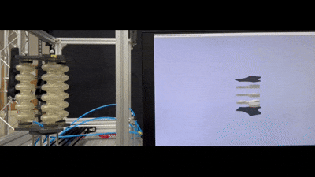
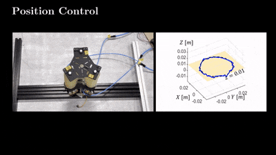

## 🎬 Demo Videos

### SOFA Simulation Demo


*Real-time SOFA simulation showing pneumatic actuation of the 3-cavity soft manipulator with dynamic pressure control and FEM deformation.*



*Real-time synchronization between the surrogate model and the real robot.*



*Result Summary*


## 📂 Data Availability

🤗 **Complete Dataset Available**: All CSV files and detailed descriptions are available on HuggingFace Datasets:  
**[https://huggingface.co/datasets/Ndolphin/SoftManipulator_sim2real](https://huggingface.co/datasets/Ndolphin/SoftManipulator_sim2real)**

The `Dataset/` folder contains structured data used for training surrogate models, evaluating pressure mappings, and validating simulation outputs. Below is a brief description of each file:

# SoftRobot Sim2Real Framework

This repository implements a complete sim-to-real framework for pressure-actuated soft robots, combining high-fidelity SOFA finite element simulations with PyBullet physics modeling and data-driven surrogate models. The codebase accompanies our AIS journal submission demonstrating successful transfer from simulation to hardware.

## 🎯 Research Contribution

**Problem**: Soft robots have complex, nonlinear dynamics that are difficult to model accurately, creating a significant sim-to-real gap that hinders effective control design and deployment.

**Solution**: A three-stage pipeline that (1) calibrates FEM parameters using SOFA simulations, (2) learns surrogate models for fast prediction via PyBullet, and (3) validates controllers on real hardware with quantified transfer performance.

## 📋 Key Components Implemented

### 1. SOFA-based Model Calibration (`Code/ModelCalibration_SOFA/`)
- **Dynamic Controller** (`DynamicController.py`): Automated pressure profile generation and data collection
- **FEM Soft Robot** (`Manipulator_dynamic_actuation.py`): 3-actuator soft manipulator with TetrahedronFEMForceField
- **Material Models**: NeoHookean, MooneyRivlin, STVenantKirchhoff hyperelastic materials via MJED plugin
- **Pressure Actuation**: SurfacePressureConstraint for cavity-based pneumatic control
- **Data Export**: Automatic logging of pressure inputs, forces, positions, and velocities to CSV

### 2. PyBullet Surrogate Learning (`Code/PhysicsBasedSimulation_PyBullet/`)

#### ActuationMapping/
- **Pressure-to-Theta MLP** (`Pressure_to_Theta_MLP.py`): Neural network mapping [P1,P2,P3] → [θX,θY,d]
  - 3-input, 3-output feedforward network with ReLU activations
  - StandardScaler normalization for inputs and outputs
  - Trained on `PressureThetaMappingData.csv`
- **L-BFGS Optimization** (`Optimization_LBFGS.py`): Inverse kinematics solver for target positioning

#### DynamicsLearning/
- **Transformer-PINN** (`TransformerPINN.py`): Physics-informed neural network for dynamics learning
  - Input: temporal sequences of [θX, θY, d, Fx, Fy, Fz]
  - Output: pressure commands [P1, P2, P3]
  - Transformer encoder with physics-based loss regularization
  - Trained on `Pybullet_joint_to_pos.csv` (100K+ samples)

#### RangeOfMotion/
- **ROM Validation** (`ROM_check.py`): End-effector workspace analysis using PyBullet forward kinematics
- Generates TCP positions and orientation normals for joint angle sweeps

### 3. Experimental Datasets (`Dataset/`)
| File | Description | Size | Usage |
|------|-------------|------|--------|
| `ForwardDynamics_Pybullet_joint_to_pos.csv` | Joint commands → TCP positions | ~100K samples | Surrogate training |
| `PressureThetaMappingData.csv` | Pressure → joint angle mapping | Training set | Actuation model |
| `MotionCaptureData_ROM.csv` | Real robot motion capture data | Validation | Ground truth |
| `Pressure_vs_TCP.csv` | Pressure → end-effector position | Calibration | Model validation |
| `RealPressure_vs_SOFAPressure.csv` | Hardware vs simulation pressure | Comparison | Calibration |
| `SOFA_snapshot_data.csv` | FEM nodal displacements | Simulation | Model analysis |

## 🔧 Technical Implementation Details

### SOFA Simulation Setup
- **Mesh**: `ManipulatorWhole25.vtk` (tetrahedral FEM mesh)
- **Material**: TetrahedronFEMForceField with Poisson ratio 0.41, Young's modulus 3000-6000 Pa
- **Actuation**: 3 pneumatic cavities with SurfacePressureConstraint (-20kPa to +35kPa range)
- **Solver**: CGLinearSolver + GenericConstraintSolver for constraint-based dynamics
- **Boundary Conditions**: Bottom surface fixed with RestShapeSpringsForceField


### PyBullet Integration
- **Robot Model**: URDF-based articulated soft robot (`SurrogateModel.urdf`)
- **Custom Control**: Joint position targets derived from pressure-angle mapping
- **Data Collection**: Automated TCP position and orientation tracking
- **Physics**: Realistic contact dynamics with configurable time stepping

### Surrogate Model Architecture
1. **Pressure→Angle**: 3-layer MLP (3→64→64→3) with ReLU
2. **Dynamics**: Transformer encoder (sequence length 30, 4 attention heads)
3. **Training**: Adam optimizer, MSE + physics loss, early stopping
4. **Deployment**: Saved models (.pth) with preprocessing scalers (.pkl)

## 🚀 Quick Start

### Running SOFA Simulations
```python
# Launch SOFA with soft manipulator scene
python Code/ModelCalibration_SOFA/Projects/Manipulator_dynamic_actuation.py
```

### Training Surrogate Models
```python
# Train pressure-to-angle mapping
cd Code/PhysicsBasedSimulation_PyBullet/ActuationMapping/
python Pressure_to_Theta_MLP.py

# Train dynamics model
cd ../DynamicsLearning/
python TransformerPINN.py
```

### ROM Analysis
```python
# Generate workspace analysis
cd Code/PhysicsBasedSimulation_PyBullet/RangeOfMotion/
python ROM_check.py
```

## 📊 Validation Metrics
- **Position Accuracy**: Mean absolute error between sim and real TCP positions
- **Pressure Tracking**: Correlation between commanded and actual cavity pressures  
- **Workspace Coverage**: Reachable volume comparison (SOFA vs PyBullet vs Hardware)
- **Transfer Success**: Task completion rate for pick-and-place scenarios


**To obtain the complete datasets**: Contact the authors or refer to the AIS journal paper for data availability.

## 📚 Dependencies
- **SOFA**: version 23.04, SoftRobots plugin, MJED materials, ModelOrderReduction
- **Python**: PyTorch, PyBullet, NumPy, Pandas, Scikit-learn
- **Hardware**: Pressure sensors, motion capture system, pneumatic actuators


## 📂 Data Availability

The `Dataset/` folder contains structured data used for training surrogate models, evaluating pressure mappings, and validating simulation outputs. Below is a brief description of each file:

| File Name                            | Description |
|-------------------------------------|-------------|
| **ForwardDynamics_Pybullet_joint_to_position.csv** | Maps joint-level commands to end-effector positions using PyBullet forward dynamics. The end-effector positions are matched with the FEM data and corresponding pressure inputs and external force applied|
| **MotionCaptureData_ROM.csv**       | Captured real-world motion trajectories used to build reduced-order models (ROM). |
| **Pressure_vs_TCP.csv**             | Shows the relationship between internal pressure inputs and the resulting TCP (Tool Center Point) position. Used in surrogate modeling. |
| **PressureThetaMappingData.csv**    | Maps pressure values to internal angular deformations (θ). Supports internal ROM training. |
| **RealPressure_vs_SOFAPressure.csv**| Compares real sensor pressures to simulated pressures in SOFA for calibration and validation. |
| **SOFA_snapshot_data.csv**          | Captured nodal displacement and deformation data from SOFA simulations. Supports sensor modeling and FEM validation. |
| **SurrogateModel_ROM.csv**          | Pretrained ROM dataset for surrogate model input-output mapping. Useful for fast inference and control learning. |
| **SurrogateModel_withTooltip_ROM.csv** | Same as above, but includes tooltip-related deformations or outputs. For tasks involving tool contact or manipulation. |

All files are in `.csv` format and can be opened with any standard spreadsheet or numerical computing tool. They are designed to support both analytical modeling and data-driven learning methods.


### Citation

"Bridging High-Fidelity Simulations and Physics-Based Learning Using A Surrogate Model for Soft Robot Control," T. Hong, J. Lee, B.-H. Song, and Y.-L. Park, Advanced Intelligent Systems, 2025.


